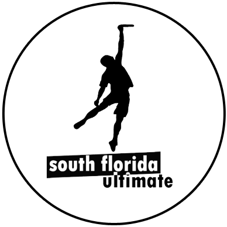

# South Florida Ultimate

[SFLUltimate.com](http://sflultimate.com) is a [Node.js KeystoneJS](http://keystonejs.com/docs/getting-started/) project running on a MongoDB and hosted on Heroku aimed to ease player registration, maintain stats.

From a front-end perspective, this project utilizes Bootstrap 3 and SCSS as a CSS preprocessor, Jade as a templating engine, and a small amount of jQuery, though some components might later be built in Angular.

## Dependencies 

You will need:
- `git` : For collaborative software development
- `node` : For running the application ([v0.12.9](https://nodejs.org/en/blog/release/v0.12.9/) recommended)
- `mongo` : For the database of content
- `grunt` : For task automation
- `heroku toolbelt` : For deployment to the Heroku platform

Additionally you will require to install:
- [JSHint](http://jshint.com/install/): Javascript lint tool.
- [Nodemon](https://github.com/remy/nodemon): Tool to restarting the application on a server side file change (while in development mode only)
- [Sass](http://sass-lang.com/install): Tool to convert scss and sass files into css files.


#### For Windows Users

- You will need python.


## Installation process

This assumes you already have the project downloaded from git.

```bash
npm install # to install all Node.js modules required by the project package.json
mongod      # to start running mongo database (need to run on separate tab or run in background)
grunt serve # to run application on port 5000 (or 3000 if you have an older version).
```

On running `grunt serve` successfully the application will now be able to be used on port 5000, at:

- [http://localhost:5000](http://localhost:5000)

> **Note**: You will need a separate `.env` file to be placed inside the project root directory for it to run successfully.  Contact the administrator to receive its contents. Additionally, to populate your database you will need the player data.


## Keystone Links

This project utilizes the Keystone.js CMS system to organize the data schemas.

- http://keystonejs.com/guide
- http://keystonejs.com/docs/getting-started/


## Example Schemas

To view the example schemas view [here](./models/Example-Schemas.md).

## Braintree Testing

- [Reference](https://developers.braintreepayments.com/reference/general/testing/node)
- **Test Credit Card Number**: 4111111111111111

## Exporting DB

```bash
mongodump --host=127.0.0.1 --db sflultimate
mongorestore -h ds039165.mongolab.com:39165 -d heroku_8xfcj7cs  -u <user> -p <password> dump/sflultimate
```

## Importing Remote DB
```bash
mongodump -h ds039165.mongolab.com:39165 -d heroku_8xfcj7cs -u <user> -p <password>
mongo sflultimate --eval "db.dropDatabase()"
mongorestore --host 127.0.0.1 --port=27017 -d sflultimate dump/heroku_8xfcj7cs
```


## Older Website 

The [older website](https://web.archive.org/web/20160110095115/http://sflultimate.com/) can be viewed via the publicly accessible wayback machine at:

- https://web.archive.org/web/20160110095115/http://sflultimate.com/


### Info

We will be playing 8 teams.

1. Orange
2. Blue
3. Green
4. Gray
5. White
6. Pink
7. Red
8. Black

Dont have games:

- March 6th
- April 30th finals (Saturday @ Amelia Earhart)
- 5-7 7-9

Hi Josh Seiden, we just had a draft last night where we picked teams.  By around tonight I should be pushing the team lists up and sharing emails to captains.

If you want a contact, you can email sflultimate@gmail.com, or send a Facebook message to the South Florida Spring League.

The people now that are helping administer the League are Gary Saltzman (helps set up fields), Diane Loveridge (pick captains, create jerseys), Raymond John Powers (run the draft, help me with the website), myself (I code the website), Joe Lackey (helps distribute jerseys/stat sheets and answer any questions about leagues), and Elena (who does the most key accounting, organizational, and insurance work that no one typically sees).

We are also setting up the schedule right now, but games will be either at 7pm or at 9pm.

We talked briefly about storing stats before the draft. this is what I had jotted down in my initial notes that I think will be a good way to handle it:

Have a collection for stats containing these fields/object:
 player_id
game_id
league_id ?
scores
assists
defends
attendance ? (if we ever wanted to track if people were there but didn't get a point)
I would have there be an index/key on player_id and game_id individually so we can easily get all of the stats for a player on their player page, and also all the stats for a game on the game page. 

league_id would be useful to quickly get all of the stats for players in a current league as opposed to career without having to get the list of games in each league then go through and get all of the stats for all of the games, but I haven't really run through the best way to produce the leaderboards in terms of efficiency.

I have ideas for all of the various pages we could have for leagues/teams/games/players so I would like to have the data be somewhat setup for that, but obviously for the spring league we just need something that is up and running and functional.

Main ideas: League Page - have a list of current leagues, upcoming leagues, past leagues. An individual league page would have rankings, schedule, leaderboard (everything linkable)

Team Page - roster, schedule, stats for players on the team available

Game Page - Teams playing, score, stats for both sides (think any sport gamecast screen)
  Also with the ability for certain users to edit in order to input these items

Player Page - list of leagues played + team they were on + total stats for that league along with user information. Ability for the specific player to alter their info on this page and mark what information they want to be public/private

At some point we need to get my computer up and running with keystone, and I need to lend you my notebook with my ideas/sketches in it


rpmThese are the games that I pulled from the pick-up Ultimate site that I have heard are legit but I have never played:
Key Biscayne Ultimate (Never been to this game)
Contact: Grant
Email: gkunks@gmail.com
Phone: 561.247.2684
Website: http://www.ratradio.net

Sundays: 6:00 @ Mast Academy

Fields: Turf or Grass, depending on which field
Description: We've been playing at Key Biscayne and Virginia Key for over 10 years now, but we have been adding more and more people over the last few years. Most of our players are from Key Biscayne but we have a good amount who come from the mainland. We range in age from 16 to 60 (average late 20's) years old, mostly male. We are pretty liberal with the rules (ie. NO hold/stall count or bricks) but most violations are enforced one way or another. 

Hialeah Ultimate Frisbee (Never been to this game)
Contact: Daniela Larez
Email: daniela.larez@gmail.com
Website: https://www.facebook.com/groups/87229532865/?notif_t=group_name_change

Thursdays: 6:30PM-9PM

Fields: Grass field Outdoors
Description: THURSDAYS: 
Sparks Park
1301 W 60th St, Hialeah, FL 33012
6:30 PM – 9:00 PM

SUNDAYS: Please email or follow us at 
https://www.facebook.com/groups/87229532865/?fref=ts
for updates


These are the games that I have played (and play regularly) and are all a lot of fun.

Saturday Ultimate at Continental Park
Contact: Roger Oprandi
Email: Rogeroprandi@gmail.com
Phone: 786.269.9963

Saturdays: 10 am
Park: Continental Park - 10000 SW 82 Avenue, Miami, FL 33156

Fields: Grass
Description: Casual pick up game with all levels welcome. Game on rain or shine at Continental Park. Please bring two shirts, one white and one dark. Most players are wearing cleats.

Sunday Ultimate at Evelyn Greer Park
Contact: Matthew Mcveigh
More info at: https://groups.google.com/forum/#!forum/miami-ultimate

Sundays: 9 am
Park: Continental Park - 10000 SW 82 Avenue, Miami, FL 33156

Fields: Grass
Description: Casual pick up game with some competitive (but older) players. Game on rain or shine at Evelyn Greer Park. Please bring two shirts, one white and one red. Most players are wearing cleats.

Ultimate at Tropical Park

More info at: https://www.facebook.com/groups/579684452071056/ - (not sure if this is public or private, I can invite you if it is private)

Mondays & Wednesdays: 8 pm
Occasionally also plays Saturday around 1pm
Park: Continental Park - 7900 SW 40th St, Miami, FL 33155

Fields: Grass/Dirt
Description: Casual pick up game with a wide range of experience levels. Rain usually cancels this game as it relies on softball field lights to be on. Game is played in the grass that is in the middle of the 4 softball fields. Most players are wearing cleats.

Ultimate Frisbee for Fun

More info at: http://www.meetup.com/Miami-Ultimate-Frisbee-for-Fun/

Interchanges from Tuesday & Wednesday: 6:45 pm
Park: Shenandoah Park - 1800 SW 21st Ave, Miami, FL 33145

Fields: Grass 
Description: Very casual pick up game with mostly beginner players. As the name implies this is a very light hearted game with low competition levels.  The games are great for beginners and a great way to get into the community if just starting to play Ultimate.  Field and Days are subject to change so check the Meet Up for updated info.

