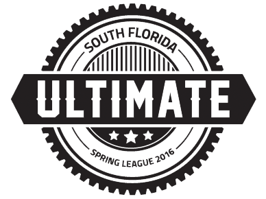

# South Florida Ultimate

[SFLUltimate.com](http://sflultimate.com) is a [Node.js KeystoneJS](http://keystonejs.com/docs/getting-started/) project running on a MongoDB and hosted on Heroku aimed to ease player registration, maintain stats.

From a front-end perspective, this project utilizes Bootstrap 3 and SCSS as a CSS preprocessor, Jade as a templating engine, and a small amount of jQuery, though some components might later be built in Angular.

## Dependencies 

You will need:
- `git` : For collaborative software development
- `node` : For running the application ([v0.12.9](https://nodejs.org/en/blog/release/v0.12.9/) recommended)
- `mongo` : For the database of content
- `grunt` : For task automation
- `heroku toolbelt` : For deployment to the Heroku platform

Additionally you will require to install:
- [JSHint](http://jshint.com/install/): Javascript lint tool.
- [Nodemon](https://github.com/remy/nodemon): Tool to restarting the application on a server side file change (while in development mode only)
- [Sass](http://sass-lang.com/install): Tool to convert scss and sass files into css files.


#### For Windows Users

- You will need python.


## Installation process

This assumes you already have the project downloaded from git.

```bash
npm install # to install all Node.js modules required by the project package.json
mongod      # to start running mongo database (need to run on separate tab or run in background)
grunt serve # to run application on port 5000 (or 3000 if you have an older version).
```

On running `grunt serve` successfully the application will now be able to be used on port 5000, at:

- [http://localhost:5000](http://localhost:5000)

> **Note**: You will need a separate `.env` file to be placed inside the project root directory for it to run successfully.  Contact the administrator to receive its contents. Additionally, to populate your database you will need the player data.


## Keystone Links

This project utilizes the Keystone.js CMS system to organize the data schemas.

- http://keystonejs.com/guide
- http://keystonejs.com/docs/getting-started/


## Example Schemas

To view the example schemas view [here](./models/Example-Schemas.md).

## Braintree Testing

- [Reference](https://developers.braintreepayments.com/reference/general/testing/node)
- **Test Credit Card Number**: 4111111111111111

## Exporting DB

```bash
mongodump --host=127.0.0.1 --db sflultimate
mongorestore -h ds039165.mongolab.com:39165 -d heroku_8xfcj7cs  -u <user> -p <password> dump/sflultimate
```

## Importing Remote DB
```bash
mongodump -h ds039165.mongolab.com:39165 -d heroku_8xfcj7cs -u <user> -p <password>
mongo sflultimate --eval "db.dropDatabase()"
mongorestore --host 127.0.0.1 --port=27017 -d sflultimate dump/heroku_8xfcj7cs
```


## Older Website 

The [older website](https://web.archive.org/web/20160110095115/http://sflultimate.com/) can be viewed via the publicly accessible wayback machine at:

- https://web.archive.org/web/20160110095115/http://sflultimate.com/


### Info

We will be playing 8 teams.

1. Orange
2. Blue
3. Green
4. Gray
5. White
6. Pink
7. Red
8. Black

Dont have games:

- March 6th
- April 30th finals (Saturday @ Amelia Earhart)
- 5-7 7-9

Hi Josh Seiden, we just had a draft last night where we picked teams.  By around tonight I should be pushing the team lists up and sharing emails to captains.

If you want a contact, you can email sflultimate@gmail.com, or send a Facebook message to the South Florida Spring League.

The people now that are helping administer the League are Gary Saltzman (helps set up fields), Diane Loveridge (pick captains, create jerseys), Raymond John Powers (run the draft, help me with the website), myself (I code the website), Joe Lackey (helps distribute jerseys/stat sheets and answer any questions about leagues), and Elena (who does the most key accounting, organizational, and insurance work that no one typically sees).

We are also setting up the schedule right now, but games will be either at 7pm or at 9pm.